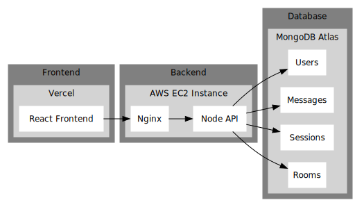

# OkayChat

A Public Messaging app with quirks, written in JavaScript.

Hosted at: [https://okaychat.ary82.dev](https://okaychat.ary82.dev)

This is the client repository of the project.

See also: [Backend Repo](https://github.com/ary82/okay-api)

### Quirks

<ul>
    <li>Effortlessly acknowledge messages with a single keystroke. Pressing Enter with an empty message will automatically send the text "Ok"!</li>
    <li>Click on <i>Generate with AI</i> to send an AI generated message based on the last five messages of your conversation</li>
    <li>Supports Multiple Logins from same Account</li>
</ul>

### Front-End

The Front end for this project is written in React, while utilising the features of various libraries such as:

<ul>
    <li>Redux toolkit for state management</li>
    <li>Axios for API requests</li>
    <li>TailwindCSS for Styling</li>
</ul>

Repo link: [https://github.com/ary82/okay-client](https://github.com/ary82/okay-client)

### Back-End

The Back end For this project is written in JavaScript, while utilising:

<ul>
    <li>Socket.io library for instant messaging</li>
    <li>MongoDB database for storing users, and messages and WebSocket rooms</li>
    <li>Calls to Google Gemini for Automatic Message Generation</li>
    <li>PassportJS for implementing User Authentication</li>
</ul>

Repo link: [https://github.com/ary82/okay-api](https://github.com/ary82/okay-api)

### Architecture/Hosting:

Here is a schematic representation of the project, showing the technologies and platforms used for hosting it:

    

